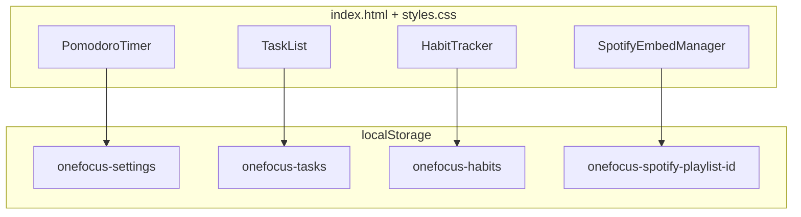

<div align="center">

# OneFocus

### Pomodoro · Tasks · Habits · Focus music

[](https://developer.mozilla.org/en-US/docs/Web/HTML)
[](https://developer.mozilla.org/en-US/docs/Web/CSS)
[](https://developer.mozilla.org/en-US/docs/Web/JavaScript)
[]()
[](https://developer.spotify.com/documentation/embeds)

<br/>

[]()
[]()
[]()
[]()

<br/>

[](https://github.com/hackerbotfz/OneFocus-FocusTimer-and-Habit-tracker/commits)
[](https://github.com/hackerbotfz/OneFocus-FocusTimer-and-Habit-tracker)
[](https://github.com/hackerbotfz/OneFocus-FocusTimer-and-Habit-tracker/stargazers)

<br/>

**[Faiz Lawan](https://github.com/hackerbotfz)**

</div>

---

A single-page productivity app combining a Pomodoro timer, task list, daily habit streaks, and an embedded Spotify focus playlist. Vanilla JavaScript—no build step, no backend.

## Overview

OneFocus unifies timed work sessions, lightweight task capture, streak-based habit tracking, and ambient focus music. Responsive two-column layout on desktop, SVG progress ring for session feedback, and keyboard shortcuts for hands-free timer control.

| Module | Behaviour |
|--------|-----------|
| **Pomodoro** | Configurable work/break intervals, session counter, Web Audio completion chime |
| **Tasks** | Add, complete, and delete tasks with persistent storage |
| **Habits** | Daily check-ins with streak logic (today / yesterday rollover) |
| **Focus music** | Spotify embed with URL parsing and saved playlist preference |

## Architecture



Four ES6 classes, each owning its DOM slice and storage key. Event-driven updates with XSS-safe `escapeHtml` on user input.

## Run

```bash
npx serve .
```

Keyboard shortcuts: **Space** start/pause · **R** reset

## Repository

```
OneFocus/
├── index.html
├── app.js
├── styles.css
├── assets/
│   └── background.jpg
└── README.md
```

## License

© Faiz Lawan.
